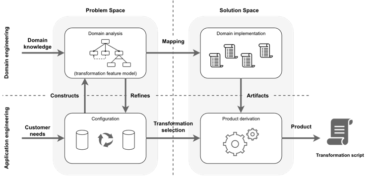

# Transformo: a tool for data transformation using SPL techniques (tool)

## Authors: Juan Pérez, Ana Soto, [Mario García], Luisa Fernández

### XVII JORNADAS DE INGENIERÍA DEL SOFTWARE Y BASES DE DATOS (JISBD 2023)

## Introduction

### Subsection one from introduction

Content from subsection one from introduction

### Subsection two from introduction

Content from subsection two from introduction

## Development

### Subsection one from development

Content from subsection one from development

### Subsection two from development

Content from subsection two from development

## Conclusion

### Subsection one from conclusion

Content from subsection one from conclusion

### Subsection two from conclusion

Content from subsection two from conclusion
